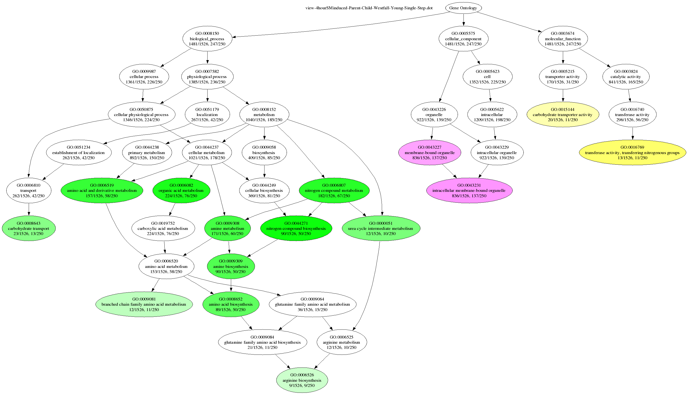

## A Tool for Statistical Analysis and Visualization of High-Throughput Biological Data Using Gene Ontology

>Mac OS X users, who experienced problems starting Ontologizer, may want to disable Java7 support for starting Webstart applications until the problem is solved. See [http://support.apple.com/kb/HT5559](http://support.apple.com/kb/HT5559) for instructions. Thanks to Christine Oger for finding this work-arround.

A number of methods have been developed to analyze microarray and other high-throughput data derived from measurements of hundreds or thousands of genes or proteins. Depending on the method, the results of analysis consist of a list of many differentially regulated genes or a partitioning of many or all of the genes in the data set into clusters (groups) that putatively share some functionally relevant characteristic. Among the many uses to which the Gene Ontology (GO) has been put is to provide a summary of such lists of genes/proteins according to functional role, biochemical reaction, or location of the gene product in the cell.
The first version of the Ontologizer has been completely redesigned to provide a versatile WebStart or desktop application for the GO term enrichment analysis whose user interface utilizes [Eclipse’s](http://www.eclipse.org/) Standard Widget Toolkit. It supports not only the standard approach to GO term enrichment analysis but also our parent-child method as described by Grossmann, topology based methods as described by Alexa and our new model-based approach

Following analysis with one of the above methods and optionally a multiple-testing correction procedure, the Ontologizer rows of terms together with their p-values or marginal probabilities, annotation counts and other information. Relevance of a term is indicated by color coding according to the sub ontology to which the term belongs, whereby the intensity of the color correlates with the maginitude of relevance.

Users can click on any term in the table to display properties and results related to the term such as its parents and children, its description, and a list of all genes annotated to the term in the study set. This information is presented as a hypertext in the lower panel with links to parent and child terms. The Ontologizer also provides a tightly integrated graphical display of the results using GraphViz.

The following pages present a brief introduction to the Gene Ontology, the standard "term-for-term" approach to statistical analysis, and the the parent child approach.

## Background

This section intends to give readers a very quick overview of the GO. The [GO homepage](http://www.geneontology.org/) is a great source of documentation. Readers are also refered to the original paper on GO by Ashburner and coworkers as well as a [recent overview](http://www.ncbi.nlm.nih.gov/entrez/query.fcgi?cmd=Retrieve&db=PubMed&dopt=Abstract&list_uids=16381878) for more information.

The Gene Ontology (GO) has provided a dynamic, controlled vocabulary for describing gene products in any organism. GO contains three extensive subontologies describing molecular function (the biochemical activity of a gene product), biological process (the objective or biological goal to which a gene product contributes) and cellular component (the place in the cell in which the biological activity of a gene product is exerted).

GO contains well over over 20,000 terms, each of which has an accession number, a name, a more detailed definition, and other information relating a term to its parent terms. Individual terms are organized as a directed acyclic graph, whereby the terms form the nodes in the ontology and the arcs the relationships. More specific terms are lower in the graph and terms are related to their parent terms by ‘is-a’ relationships (e.g. condensed chromosome ‘is-a’ chromosome) or ‘part-of’ relationships (e.g. nucleolus is ‘part-of’ nucleus). In contrast to simpler hierarchical structures, one node in a directed acyclic graph may have multiple parents. For instance, the term ‘DNA replication’ (GO:0006260) is a child of the term ‘DNA replication and cell cycle’ (GO:0000067) and also of the term ‘S phase of mitotic cell cycle’ (GO:0000084). This allows for a more flexible, expressive and detailed description of biological functions.

The GO terms do not themselves describe specific genes or gene products. Rather, collaborating databases generate gene association files consisting of links between genes or gene products and GO terms. Genes and gene products are annotated at the most specific level possible, but are considered to share the attributes of all the parent nodes. Association files have been made available for m organisms, including human, mouse, yeast and Caenorhabditis elegans.

## Overrepresentation

### Introduction

We use the designation "Term-for-Term (TFT) analysis" to refer to the standard method of performing statistical analysis for overrepresentation in GO. Please see the section on Parent-Child analysis for an explanation of this name.

TFT analysis is based on the following assumptions. We are generally interesting in knowing if a subset of genes from a larger population has any special characteristics. We will define the subset as our study group. This could be a set of overexpressed genes from a microarray experiment. Note that there may be several study groups, for instance, overexpressed genes and underexpressed genes. The population group would then be defined as all genes represented on the microarray. We can then ask if the frequency of a annotation to a Gene Ontology term is different for the study group compared to the overall population.

### Modified Fisher's Exact Test

Thus, we can imagine a binary random variable for each gene in the population with two mutual exclusive values: 1) The gene is annotated to the GO term in question or 2) The gene is not annotated to the GO term.

Assume the population of all genes contains M genes annotated to some term t and N genes not annotated to the term. The population thuis contains a total of M+N genes. The study set contains k genes, r of which are annotated to the term t. The hypergeometric distribution then gives the probability of sampling exactly r genes annotated term t:

Since we are interested in knowing the probability that a certain number of annotations to a certain GO term occured by chance (with low probabilities corresponding as usual to a high statistical significance), we actually need to calculate the chance of seeing r or more annotations in our study set:

This is essentially the same as the Fisher Exact Test, except that we are only testing for overrepresentation. The Fisher Exact test, in contrast, tests for either extreme (over- or underrepresentation). It has become the convention in GO analysis not to test for underrepresentation of GO terms, because the biological significance of underrepresentation is much less clear than the significance of overrepresentation.

### Parent-Child Analysis

The Parent-Child method represents a new algorithm for identifying overrepresented Gene Ontology (GO) annotations in gene sets. While the current methods treats each term independently and hence ignores the structure of the GO hierarchy, our approach takes parent-child relationships into account. Over-representation of a term is measured with respect to the presence of its parental terms in the set. This resolves the problem that the standard approach tends to falsely detect an over-representation of more specific terms below terms known to be over-represented. Our approach comes at no additional computational complexity when compared to the standard approach.

The parent-child method is described in detail in [Grossmann et al. (2007), Improved Detection of Overrepresentation of Gene-Ontology Annotations with Parent-Child Analysis](http://www.ncbi.nlm.nih.gov/pubmed/17848398?dopt=Abstract) (Available as an Open-Access Bioinformatics Article). A conference report from the RECOMB06 [An Improved Statistic for Detecting Over-Represented Gene Ontology Annotations in Gene Sets](http://dx.doi.org/10.1007/11732990_9), has appeared in Springer's Lecture Notes in Computer Science.

### Multiple Testing

Since in general we will test up to thousands of GO terms for overrepresentation, we need to apply some correction for multiple testing. At present, the Ontologizer uses a classic Bonferroni correction, meaning it multiplies the nominal p-values calculated as described above by the number of tests performed. This is a very conservative form of correction for multiple testing. We can limit the number of tests performed by deciding not to test GO terms that do not annotate any genes in the population (since the study group is drawn from the population, if no genes are annotated than obviously overrepresentation of the term is impossible). Additionally, if a term annotates only one gene in the population than it is apparent that testing for overrepresentation in the study group has little meaning. Note that the number of genes in the study group annotated to the term does (and should) not need to be taken into account here.

It is possible to perform analysis on any number of groups (clusters) of genes simultaneously. The Ontologizer does not perform multiple testing correction based on the number of clusters analysed. Depending on the question posed by the user, it may or may not to be appropriate to do so.

Finally, note that Gene Ontology annotations are made to the most specific term possible. All ancestors of the term are considered to be implicitly annotated. Therefore, if we are calculating the total annotations of a term, we need to count annotations to all (more specific) descendents of the term also. Note that we need to avoid introducing "extra" (duplicate) counts if there are multiple paths from a descendent term to an ancestor term, or if two distinct descendents of a term are annotated for a certain gene. A discussion of these issues is available in Robinson et al. (2004) [Gene-Ontology analysis reveals association of tissue-specific 5' CpG-island genes with development and embryogenesis](http://www.ncbi.nlm.nih.gov/pubmed/15254011?dopt=Abstract)

## How-To

The following sections show some solutions to some common problems revolving around the lack of uniformity of gene name nomenclature, and show examples of Ontologizer output for C. elegans, mouse, yeast and Drosophila. 

### Gene Ontology Files

The Ontologizer requires the Gene Ontology Terms file (gene_ontology.obo), which is the file that describes individual GO terms and their relationships to one another. This file can be downloaded from the [Gene Ontology homepage](http://geneontology.org/). Alternatively, the Ontologizer can automatically download the latest version if you specify the URL to this file.

### Gene Association Files

The OBO file describes only the functional hierarchy of terms and does not provide functional annotations for actual genes. For this purpose, users need to download the appropriate annotation file. These files are generally entitled gene_association.XXX, where XXX stands for the database or species (e.g., mgi for [Mouse Genome Informatics](http://www.informatics.jax.org/), and sgd for [Saccharomyces Genome Database](http://www.yeastgenome.org/). Association files can also be downloaded from the Gene Ontology homepage. The Ontologizer can also automatically download the latest version of the association file for a number of commonly analyzed organisms (See the tutorial within the Ontologizer application for more details).

### Data Files

The Ontologizer produces listings of GO annotations for user supplied lists of genes or gene products. One situation in which this can be useful is for "clustering" analysis of microarray data, but there are many other potential uses. The Ontologizer assumes that each group of genes resides in its own file, and presently accepts FASTA files as well as files in which each gene is on its own line. For FASTA and plain files, the first word on a line (for FASTA files, the first word following the ">" sign) is taken to be the name of the gene or gene product, and anything else on the line is taken to be a description. It is easy to extend the source code to allow for other types of file formats.

The user should copy files representing the results of clustering into a separate directory. Note that the names of the genes or gene products need to correspond to the nomenclature used in the association file for the Ontologizer to function properly. This can be especially problematic if (for instance) EST names are present in the results of clustering. Several solutions to such problems are presented below on this web page in the form of Perl scripts that can transform files and gene names such that the Ontologizer will recognize the names.

### Downloading the Ontologizer Source Code

The [source code](http://svn.code.sf.net/p/ontologizer/svn/) contains all the code as well as an Eclipse project file. The source code can be imported as an Eclipse project and compiled with Eclipse.

### Preparing Data for the Ontologizer

The Ontologizer uses the gene or gene-product nomeclature as found in the various gene_association files. The Ontologizer recognizes names entered as DB_Object, DB_Object_Name, or Synonym in these files. However, in many cases, gene names will be listed in other form, such as for instance EST accession numbers or Affymetrix ids. Further details on the gene_association files can be found on the Gene Ontology website. In these cases, it will be necessary to transform your data by mapping non-standard gene ids to a form that will be recognized by the Ontologizer.

Although there are many ways of doing this, we recommend using scripts to transform the files into new files where the first word is the standard gene or gene-product name, and everything after the first tab-stop is an optional description consisting of at least the original name or accession number (so that the user can refer back to the original data if desired). The Ontologizer will automatically output the description underneath the standard name in the "detail" page for each cluster.

The following sections present sample output from the Ontologizer for several different species. In many cases, we were able to use the output files directly without further processing (For C. elegans for instance). In other cases, it was necessary to create a mapping for the names of the original files such that they would conform to those used in the gene_association files. We present some "cookbook" Perl scripts that demonstrate how to perform such transformations.

### C. elegans

The [recommended nomeclature for C. elegans](http://www.wormbase.org/wiki/index.php/UserGuide:Nomenclature_nematode) forsees that genes are given names consisting of three italicized letters, a hyphen, and an italicized Arabic number, e.g., dpy-5. However, it is still not uncommon to see cosmid names: Sequences that are predicted to be genes from sequence data alone were initially named on the basis of the sequenced cosmid, plus a number. For example, the genes predicted for the cosmid K07F5 are called K07F5.1, K07F5.2, and so on. As more becomes known, it is expected that these names will be replaced by standard three-letter names.

In this example, we used the Ontologizer to analyze a set of genes identified by [Liu et al. (2004)](http://www.ncbi.nlm.nih.gov/pubmed/15380030?dopt=Abstract) as being regulated by TGFbeta during entry into dauer diapause in C. elegans.

When resources are scant, C. elegans larvae arrest as long-lived dauers under the control of insulin/IGF- and TGFbeta-related signaling pathways. The authors identified genes that show different levels of expression in a comparison of wild-type L2 or L3 larvae (non-dauer) to TGFbeta mutants at similar developmental stages undergoing dauer formation. The data shown here represent the strongly regulated (>2.1 fold) genes in this experiment and were taken from table 2. The population set was taken to be all C. elegans genes for which annotations were provided by Wormbase. Among other things, GO analysis revealed that a number of terms related to ribosomes were highly significantly overrepresented. The gene names in these clusters represent a mix of cosmid and standard names. The **gene_association.wb** file provided by Wormbase and the cluster files with gene names were used as is. [Example data](https://github.com/charite/charite.github.io/blob/master/media/ontologizer/examples/yeastSampleFiles.zip?raw=true).

### Mus musculus
Mouse Genome Informatics (MGI) (Jackson Laboratories) supplies a gene_association file for M. musculus. They also provide [guidelines for mouse gene nomeclature](http://www.informatics.jax.org/mgihome/nomen/gene.shtml). The gene_association.mgi file provided by MGI contain annotations based primarily on MGI accession numbers. Therefore, one way of using the Ontologizer to analyze mouse datasets that are based on NCBI accession numbers is to transform the accession numbers into the corresponding MGI accession numbers. We present a way of doing this with perl scripts using files from NCBI's Entrez Gene (gene_info and gene2accession).

The perl script NCBI2MG.pl maps NCBI accession numbers via Entrez Gene ids to MGI accession numbers. The output file, NCBI2MGI.txt, can be used as a mapping file for the Ontologizer. The original accession numbers are visible (together with the full gene name, locusID, and UniGene cluster) directly after the MGI accession number. For accession numbers for which no MGI id could be identified (mainly some ESTs), just the original accession number is displayed. The corresponding original files can be [downloaded here](https://github.com/charite/charite.github.io/blob/master/media/ontologizer/examples/mouseSampleFiles.tar.gz?raw=true).

### Results

The results window contains a table with one line for each gene in the population. Clicking on a line causes more information about a term to be displayed in the lower panel. A list of annotated genes/proteins is shown, and links to parent and child terms are available. By clicking on the symbol for "graph", a graph is generated and shown in the right hand panel. Buttons for zooming in and out are provided. The table of results can be saved and the graph can be saved as a PNG file or a dot file (this is the GraphViz definition file). Note that the graphics function requires that [GraphViz](http://www.graphviz.org/) is installed on your computer.

## Datasets

### Datasets for GO Analysis
A typical dataset for statistical analysis using the Ontologizer or many other GO tools will consist of a list of gene/protein names making up a study set (for instance, all differentially expressed genes in an experiment) and a longer list of gene/protein names making up the population (for instance, all genes represented on a microarray that was used to perform the experiment). It has been our experience that is is difficult to find such datasets on the web, which is a stumbling block for testing new algorithms or tools for GO analysis. 

On this page we present an R/Bioconductor script that makes it easy to create study sets/population sets using publically available microarray datasets from NCBI's Gene Expression Omnibus (GEO) database. It should be easy to adapt this script to analyze in house datasets derived from Affymetrix microarray hybridizations. Currently there are thousands of datasets in the GEO database, so extensive testing and comparisons of different algorithms should be possible. On this page, we explain the R script and present several datasets obtained using it.

### Software Prerequisites and Data Sources

*R and Bioconductor*

R is an extremely powerful open-source language for statistical computing and graphics that runs on all standard computer plattforms. Bioconductor is a set of packages for the R environment that provide a larege number of useful tools for the analysis of microarray and other forms of genomic data.

*Bioconductor packages*

Our script makes use of two Bioconductor packages to perform the analysis. The package GEOquery automatically retrieves microarray from the GEO website, and the package limma performs a number of statistical analyses including the identification of differentially expressed genes. Depending on your setup, you may need to install these packages. There are several ways of doing this, but the easiest is probably

    source("http://www.bioconductor.org/biocLite.R")
    biocLite("GEOquery")

*GEO*

NCBI's Gene Expression Omnibus (GEO) database is a repository of thousands of microarray datasets. GEO DataSets (GDS) are curated sets of GEO Sample data. A GDS record represents a collection of biologically and statistically comparable GEO Samples and forms the basis of GEO's suite of data display and analysis tools.

### R/Bioconductor Code for Creating Study and Population Datasets
 
The following code demonstrates how to use R/Bioconductor to download and analyze datasets from the NCBI GEO database and to create study and population sets from them.

	#Fetch data and create study/population datasets for the Ontologizer

	library(Biobase)
	library(GEOquery)
	library(limma)

	dataset.name <- "GDS2821"
	gds <- getGEO(dataset.name,destdir=".")
	#gds <- getGEO(filename = system.file("GDS2860.soft.gz",package = "GEOquery"))
	eset <- GDS2eSet(gds,do.log2=TRUE)
	## extract affymetrix IDs
	ids<-rownames(exprs(eset))

	## Extract phenotypic information
	## Use gsub to simplify the names (makes it easier to define factors)
	state <- Columns(gds)$disease.state
	state <- gsub("Parkinson's disease","parkinson",state)
	
	## Define the factors for the statistical analysis
	f <- factor(state)
	design <- model.matrix(~0+f)
	contrast.matrix<-makeContrasts(fparkinson-fcontrol,levels=design)
	
	## Get the platform name and check that we got data
	platform<-as.character(Meta(gds)$platform)
	print(paste("Platform",platform,"contains ",length(ids),"spots"))
	
	## Retrieve the platform information.
	gpl.name <- paste(platform,".soft",sep="")
	if (file.exists(gpl.name)) {
	  gpl<-getGEO(filename=gpl.name,destdir=".")
	} else {
	  gpl<-getGEO(platform,destdir=".")
	}
	
	## This is the correspondence between the
	## affymetrix IDs and the gene symbol
	mapping <- Table(gpl)[,c("ID","Gene.Symbol")]
	
	### t-test
	fit<-lmFit(eset,design)
	fit2<-contrasts.fit(fit,contrast.matrix)
	fit2<-eBayes(fit2)
	
	## Adjust for multiple testing
	p.values<-fit2$p.value
	p.BH <- p.adjust(p.values,method="BH")
	
	# get the indices of all significant p values
	ord<-order(p.val)
	ord.sign<-subset(ord,p.val[ord]<0.1)
	
	## check results
	mapping[ord.sign,]
	
	## Write study set
	studyset.name = paste("study",dataset.name,".txt",sep="")
	write.table(mapping[ord.sign,2],file=studyset.name,col.names=F,row.names=F,quote=F)
	
	pop.name = paste("population",platform,"txt",sep="")
	write.table(mapping[,2],col.names=F,row.names=F,quote=F,file=pop.name)
 

## Webstart
 
The Ontologizer can be started directly from this website using Java webstart by clicking on the following icon:

Webstart applications are started directly from a web browser, which downloads the program code to the local computer. If the code has already been downloaded, the browser checks if the server has a newer version. If not, the local copy of the program is started. Further information is available at Sun's webstart site.

For users, webstart means that the webbrowser will automatically download and use the latest available version of the webstart program, so users will automatically benefit from updates and bugfixes. Once the current version of the program has been downloaded, the program will start essentially as quickly as a traditional desktop application.

### Potential Problems with the Term Browser and Help Window of the Ontologizer

With some combinations of debian linux and firefox, we have noticed a problem with the Ontologizer finding the libraries needed to allow browsing of GO terms and the show the HTML format of the help system. If you notice this problem, it may help to set the variable MOZILLA_FIVE_HOME in the file /etc/environment as follows:

	MOZILLA_FIVE_HOME=/usr/lib/xulrunner and to install the latest version of the packages "xulrunner" and "libxul-dev" with apt-get or aptitude.

The Ontologizer should start properly with all common Windows browsers (we have tested it with IE6, IE7 and Firefox).

### MacIntosh
The Ontologizer is built using GUI elements from the Standard Widget Toolkit (SWT) known from Eclipse. SWT has been built and test for Windows and Linux systems and the Ontologizer should work without problems on machines running Linux or modern versions of Windows. Unfortunately, the SWT for Mac OSX is not yet advanced enough, and therefore we decided to declare Ontologizer for Macintosh as unsupported at this time. Embarassed

## Manual Invocation

Here you can find the binary of the [Ontologizer application](). It can be used if, for instance, the webstart facility doesn't work for your platform.

In order to run the application, you need to have the proper SWT-jar as well. This can be obtained by following [Eclipse's SWT homepage](http://www.eclipse.org/swt/). Current versions of Ontologizer are build against version 3.7 of SWT, thus it is recommended to use the [SWT 3.7](http://download.eclipse.org/eclipse/downloads/drops/R-3.7.2-201202080800/#SWT) as well. Note that the platform of the SWT archive has to match the platform of your computer system. For instance, if you are running on Windows, download the Windows SWT archive, or if you are running on a 64 bit x86 Linux, download the SWT archive indicated by x86_64.

Once you have downloaded the ontologizer.jar file and located the swt.jar file within the downloaded SWT archive you can start Ontologizer by typing (on Linux)

	java -Xmx1G -cp swt.jar:ontologizer-gui-with-dependencies.jar ontologizer.gui.swt.Ontologizer
	
or by typing (on Windows)

	java -XmX1G -cp swt.jar;ontologizer-gui-with-dependencies.jar ontologizer.gui.swt.Ontologizer
	
in the command line, assuming that both swt.jar and ontologizer.jar files are present in the current directory.On MacOSX you may have to add -XstartOnFirstThread, -d32 or both before the -cp argument, depending on the SWT version you have just downloaded.

## Command Line
This how-to describes the command-line version of the Ontologizer. This version can be used for batch processing or pipelines. Most general users will prefer the Java WebStart version, though. At first, download the .jar file.

A possible more recent version of the command line utility is available from our [Hudson installation](http://compbio.charite.de/hudson/job/ontologizer.cmd/lastSuccessfulBuild/artifact/dist/cmdline/)

Ontologizer is a Java-Application and needs to be started via the 'java' command and be invoked with a plenty of arguments. All possible command arguments can be viewed via the --help argument. E.g. java -jar Ontologizer.jar --help. Here is a full list of options:

	Short Option	Long Option	Explanation
	-m	--mtc	Specifies the MTC method to use. Possible values are: "Bonferroni" (default), "None", "Westfall-Young-Single-Step"
	-c	--calculation	Specifies the calculation method to use. Possible values are: "Parent-Child-Union", "Parent-Child-Intersection", "Term-For-Term" (default). For a full list, consult the output of the -h option.
	-a	--association	File containing associations from genes to GO terms. Required
	-d	--dot	For every studyset analysis write out an additional .dot file (GraphViz) containing the GOTerm graph with significant nodes. The optional argument in range between 0 and 0.5 specifies the maximum level on which a term is considered as significantly enriched. By appending a GO Term identifier (separated by a comma) the output is restriced to the subgraph originating at this GO Term.
	-f	--filter	Filter the gene names by appling rules in a given file (currently only mapping supported).
	-g	--go	Path to gene_ontology_edit.obo file (Required)
	-h	--help	Shows this help
	-i	--ignore	Ignore genes to which no association exist within the calculation.
	-n	--annotation	Create an additional file per study set which contains the annotations.
	-o	--outdir	Specfies the directory in which the results will be placed.
	-p	--population	File containing genes within the population. Required
	-r	--resamplingsteps	Specifies the number of steps used in resampling based MTCs
	-s	--studyset	File of the study set or a directory containing study set files. Required
	-v	--version	Shows version information and exits

Instructions for Running the Ontologizer

In order to do something useful, Ontologizer must be started with several arguments (as indicated with "Required" within the output above).
 
First, you are required to specify the -g (or --go) option. This defines the path to a file which contains the GO terminology and structure. Ontologizer is able to parse files in the OBO format. Such are available directly at the GO Website.
 
Second, you are required to specify the -a option which defines the mapping of gene names to GO terms. The GO Website provides association files for a variety of organisms, as well.
 
Third, you must specify a population file with the -p option. This file contains all gene names (one per line) of the population set, e.g. the names of the genes of your microarray.
 
Last, you need to specify the path to your study set(s) with the -s option.. This can eighter be a single file for a single study set or a directory, in which case all files (ending with *.txt) are considered as separate study sets. As for the population file, one line represents only a single gene name.
 
When started with these four parameters only, the output of Ontologizer's calculation is written to a basic ascii table file into the same directory where the study files are located. The table's filename is derived from the name of the study set in question but prepended with "table-" string.
 
Using the -d option, you can instruct Ontologizer to create a graphical output of the results. For every study set, a file (name is prepended with "view-") is written which can be read by the graphviz 'dot' tool to produce a viewable graphics file. In this file, terms are depicted by nodes and their hierachical relations are depicted by edges. Because the GO DAG contains a huge amount of terms, the graph is constructed only for signifant terms and their predecessors (up to the source) and those significant terms are highligthed. Which terms are considered as significant is influenced by their p-values and the significance threshold. This threshold is specified as a parameter to the -d argument. It must be a valid floating point value ranging from 0 to 0.5. For example use "-d 0.05" to define those terms as significant whose p-value falls below 0.05.
 
In addition, you can specify a GO Term ID, after the floating-point value (separated by ","). In this case only the subgraph starting at this term is written. For example use "-d 0.05,8152" to get only a graph with the term id GO:0008152 (metabolism) and its successors within the subgraph emanating from GO:0008152 such that all significantly overrepresented terms are included in the graph.
 
Some sample datasets and population sets can be downloaded from this page.
To perform parent-child analysis using Westphal-Young MTC on the Yeast data set from the tutorial page and display the results using dot, enter the following command:

	java -jar Ontologizer.jar -a gene_association.sgd -g gene_ontology.obo -s study/4hourSMinduced.txt -p population.txt -c Parent-Child-Union -m Westfall-Young-Single-Step -d 0.05 -r 1000
The corresponding files must be in the current directory (or their full path must be indicated). To create a PNG image with the result, enter

	dot -Tpng view-4hourSMinduced-Parent-Child-Westfall-Young-Single-Step.dot -oExample.png
	
The corresponding graphic should look something like this:

## Obtaining Graphviz

Graphviz is a Open Source project which provides tools for layouting and depicting graphs. Hereby, graph references to mathematical entities which consists of nodes and edges.

A installed Graphviz system is a requirement for Ontologizer's facility to visualize the results of an enrichment analysis. More precisely, the tool named dot is invoked which performs the layouting step of the graph.

Windows users can obtain the installation package of Graphviz following the Download link of www.graphviz.org. On this site, you also can find the latest source packages which can be used, for instance by Linux, users to compile the package. Linux Distributions such as Debian provide binary packages for Graphviz as well. This allows a straithforward installation of Graphviz.

Note that in general, the standard installtion (of the Windows and Linux installation) is perfectly suited for Ontologizer. If however, for any reason, the dot exectutable is not in the command path, you have to tell Ontologizer explicitly where this command can be found by entering the full path within the Preferences window, which can be obtained via the Window > Preferences.... menu entry.

## Accessing Source
 
The source of Ontologizer can be found in an SVN repository which is hosted on SourceForge. The project name is ontologizer.
